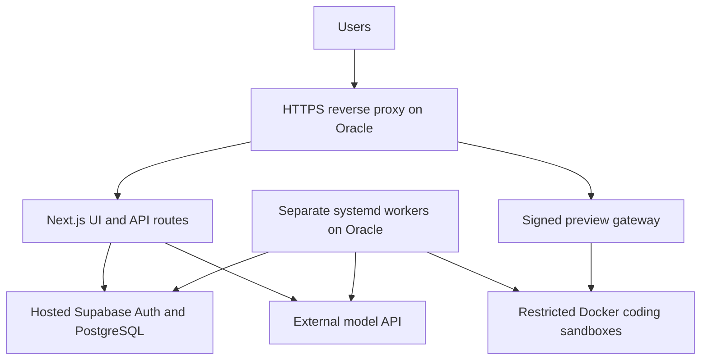

# Oracle pilot deployment and provider activation

Phase 1 implementation follow-up: [release runbook](ORACLE_RELEASE_RUNBOOK.md)
and [current verification](../verification/ORACLE_PHASE1_2026_10_08.md). Image
publishing, worker releases, resource admission, proxy configuration, backup and
explicit model selection are implemented locally. Native CI, host deployment,
public TLS and live model acceptance remain separate gates; unchecked items
below include both implementation and external acceptance requirements.

Updated 2026-10-08. This is the current implementation and rollout plan for
hosting Ryvix itself. It supersedes older rollout ordering and free-tier sizing
in the [provider inventory](PRODUCTION_PROVIDER_PLAN.md). Customer deployments
continue to use their own CI/CD. Checkboxes below are acceptance gates, not claims
that the host, integrations or deployment have been configured.

## Decision and scope

Start a restricted pilot with the Next.js UI/API application, separate workers,
and isolated Docker workspaces on one Oracle Ampere A1 VM. Keep Supabase hosted
and use an external supported model API. Oracle runs AI orchestration, not a
large locally hosted coding model. Add Vercel only after assessing its cost and
the necessary serverless changes. Move customer sandbox execution to a separate
host before expanding beyond the controlled pilot.

The proposed single host shares resource and failure boundaries. Separate
processes preserve restart and credential boundaries but do not provide host
isolation or high availability. No 100% uptime, fixed RAM savings or permanently
zero total cost is promised.

## Provider constraints checked October 8

- Oracle's current Always Free documentation lists 1,500 OCPU-hours and 9,000
  GB-hours monthly, equivalent to **2 OCPUs / 12 GB total** for Always Free
  tenancies. The **200 GB** storage allowance combines boot and block volumes.
  Verify the actual tenancy, home-region capacity and eligibility labels before
  provisioning. Idle reclamation is possible; budget alerts are not spending caps.
- Vercel Hobby is for personal non-commercial use. Deploying this repository's
  `web` workspace deploys Next.js APIs as well as UI. Moving only the frontend
  requires explicit routing/authentication work; moving UI/API together requires
  checking streams, function limits, pool growth and filesystem persistence.
- Hugging Face currently requires a paid account plan to create Docker Spaces,
  even though CPU Basic hardware has no hourly charge. Free inference accounts
  have no included credits. A Docker Space is not validated as a host for the
  Docker daemon and sandbox controls Ryvix requires.
- Koyeb Free is 512 MB / 0.1 vCPU and sleeps after one hour without traffic;
  Render Free web services sleep after 15 minutes. They are not the selected
  host for persistent Ryvix workers. Keep-alive pings are not an uptime plan.
- Supabase Free may pause after low activity. AI quotas, domains, messaging,
  storage, backups and eventual production plans can introduce costs.

These are dated published limits, not a check of the user's provider accounts.
See primary references below and recheck at provisioning time.

## Current code versus required implementation

| Area | Existing foundation | Required before acceptance |
| --- | --- | --- |
| Web deployment | Standalone Next.js Dockerfile, production Compose, main CI/CD gate | Explicit ARM64 image build, native dependency validation, real host installation |
| Workers | Separate systemd units, optional grouping, pool caps and session guards | Deploy matching release revision, configure ownership/secrets, verify restart/lock recovery |
| Coding | Sequential jobs per worker, bounded containers, host ownership | ARM64 Node/egress/relay images, allowlisted digests, total preview/resource admission budget |
| Preview | Signed gateway and persisted host/domain map | Wildcard DNS/TLS, correct proxy routing and invalid/expired signature tests |
| Authentication | Manual login, Google button/callback, phone onboarding | SMTP, OAuth configuration, real provisioning and recovery tests |
| WhatsApp | Admin connector, verified phone links, signed webhook, assistant/outbox | Meta credentials, Graph version, templates, subscriptions and live receipt tests |
| AI | Provider gateway, model environment overrides and attempt accounting | Audit selected endpoint/model/defaults, response parsing, quotas and live request behavior |
| Persistence | Hosted DB, migration history, local AI files and web volume | Fresh schema check, worker file ownership, backup/restore and retention verification |

The gateway still contains older Gemini/Claude defaults and a legacy Hugging
Face endpoint. Review the selected adapter rather than assuming a key makes it
operational. Use an explicitly verified model override; other adapters remain
disabled until checked. The workspace loop is sequential, but completed previews
can outlive a job: one job at a time does not limit total running containers.

## Phase 1 - finish deployable code on Testing_branch

- [ ] Add ARM64 or multi-architecture application image publishing to CD.
  Current plain Docker build on `ubuntu-latest` does not establish ARM64 support.
- [ ] Build and inspect Node workspace, egress proxy and preview relay images for
  ARM64. Record immutable digests and allowlists. Validate native dependencies,
  actual sandbox execution and representative customer repository compatibility.
  Do not assume x86-only customer tooling works on ARM.
- [ ] Coordinate web/worker release installation and rollback to the same Git
  revision. The current web Compose deployment does not start workers.
- [ ] Supply reviewed reverse-proxy configuration for app and wildcard previews,
  including streaming behavior, signed routing and automated TLS renewal.
- [ ] Enforce a host resource budget: one worker/job initially, bounded retained
  previews, queue backpressure, disk cleanup and limits on active sandboxes.
  Start from the existing 1 CPU / 2 GB sandbox defaults, then measure headroom;
  never infer capacity from the 2 CPU / 4 GB per-container maximum.
- [ ] Verify persistent AI directories and write ownership. Avoid concurrent
  writers corrupting shared files; define process ownership or durable storage.
  Preserve existing runtime data and exclude it from automatic Git commits.
- [ ] Audit the selected AI adapter, explicit model, errors/timeouts, structured
  changes and usage reporting. Test quota exhaustion without unapproved paid
  fallback. Review data handling before sending private customer source.
- [ ] Complete typecheck, lint, offline tests, browser fixtures, secret scan and
  isolated production build. Run actual ARM64 checks separately. Offline tests
  must preserve `ai/data`; fixture success is not live provider acceptance.

## Phase 2 - operator preparation in parallel

- [ ] Confirm Oracle tenancy capacity, eligible image and 2 OCPU / 12 GB VM.
  Use an ARM64 Linux distribution supported by the selected Node/Docker tooling.
- [ ] Choose final app hostname and a separate preview domain. Prefer a separate
  registrable preview domain for untrusted customer content. Provision DNS-01
  wildcard TLS and narrowly scoped DNS credentials.
- [ ] Allocate boot/workspace storage inside the verified allowance; configure
  rotation, expiry and free-space monitoring. Preserve a previous release image.
- [ ] Prepare provider accounts, test recipients/repository and required consent
  or template reviews. Final callback tests wait for the deployed HTTPS origin.
- [ ] Store secrets in protected server configuration or existing backend Vault.
  Separate web, worker and provider scopes. Never expose secrets via NEXT_PUBLIC
  variables, logs, images, documentation or chat.
- [ ] Plan backups for the database and necessary persistent files, retention,
  encryption, storage location and a restoration test. A backup on the same VM
  alone does not protect against losing that host.

## Phase 3 - restricted HTTPS deployment

- [ ] Configure firewall/SSH access, patching and service users. Public traffic
  reaches HTTPS; web/gateway listeners stay private behind the proxy. Do not
  expose Docker, database credentials or individual sandbox ports publicly.
- [ ] Install reviewed images and web release; mount persistent data. Run web
  without Docker privileges. Only the trusted workspace controller accesses
  Docker; customer containers never receive the socket or provider environment.
- [ ] Set `RYVIX_PUBLIC_URL`, the required build-time public settings, preview
  domain/signing secret, stable worker host ID and matching host-domain map.
  Configure `RYVIX_WORKSPACE_NODE_IMAGE`, `RYVIX_WORKSPACE_EGRESS_IMAGE` and image
  allowlist using the reviewed artifacts. See `.env.example` for the inventory.
- [ ] Verify Supabase TLS, membership/RLS and migration ledger against this
  release. Last recorded applied migration is `20261007000001`; recheck rather
  than replaying migrations blindly. No new migration is implied by this plan.
- [ ] Use direct/session database connections for session-lock workers. Tune
  per-process pool caps with headroom for web, replicas, probes and deployment
  overlap. Do not rewrite worker endpoints to transaction port 6543.
- [ ] Configure SMTP and authentication URLs. Keep unconfigured features and
  optional workers disabled; a deployed UI is not proof that all features work.
- [ ] Run `npm run verify:runtime` in the target environment. It checks required
  settings and read-only DB readiness, not complete provider delivery. It also
  requires the agent release manifest; prepare versioned binaries/checksums and
  trusted signing configuration for the enabled monitoring rollout.
- [ ] Start selected worker services and verify host locks, health, shutdown and
  restart behavior. Run workspace verification only on the designated Docker
  host after reviewing its effects. Do not run two supervisors for the same work.

## Phase 4 - real API activation before public launch

Prepare accounts before deployment; configure final callbacks and exercise real
flows after the restricted HTTPS deployment. Local/tunnel tests can help but do
not replace tests on the final origin. Production deployment is not public launch.

| Service | Prepare before deployment | Activate/test after HTTPS deployment |
| --- | --- | --- |
| Supabase | Project, keys, schema and backup plan | TLS, RLS, Auth URLs, restore test |
| SMTP | Sender, credentials and allowed sending configuration | Actual signup, reset and notification delivery; application SMTP and hosted Supabase Auth SMTP are separate settings |
| Google login | OAuth Web client, consent, identity scopes and test accounts | Supabase provider and exact app callback, new/returning accounts, chooser and manual login |
| GitHub | Existing supported OAuth/connection permissions, test repository and webhook secret | Connect, clone, receive events, create an explicitly approved test PR |
| AI | Selected adapter/model, credential, quota/budget and data terms | Oracle request, chat stream, structured coding changes, failures and usage |
| Meta WhatsApp | App/business setup, test number, permission-scoped token, templates | Final webhook, connector, OTP, inbound assistant, outbox receipts and opt-out behavior |
| Gmail inbox, optional | Separate OAuth scopes and consent; Google login does not grant mailbox access | Gmail callback, selected polling/push/reviewed-reply flows |
| Agent/operations | Signed release artifacts, test server and exact allowlists | Enrollment/telemetry, then separately approved restart/recovery |

### Google and email

Google redirects to the callback shown in Supabase's Google provider settings;
Supabase redirects to `https://APP_HOST/auth/callback`. Do not interchange these
URLs. Follow [Google login setup](../integrations/GOOGLE_LOGIN.md). Confirm profile
and workspace provisioning, retained roles, logout and password recovery. OAuth
success alone does not prove workspace provisioning. Google activation remains
after deployment; account preparation can happen beforehand.

### Meta WhatsApp

1. Prepare the Meta app/business account and designated test sending number.
   Confirm the account's current verification, permission and template rules;
   Meta documentation was rate-limited during the October 8 recheck.
2. Configure `WHATSAPP_GRAPH_VERSION`, `WHATSAPP_APP_SECRET` and
   `WHATSAPP_VERIFY_TOKEN` on the appropriate services. Validate token scope and
   expiry/rotation; a temporary test credential is not a production credential.
3. Register `https://APP_HOST/api/webhooks/whatsapp`, complete its verification
   challenge and subscribe the required business-account events.
4. Use Ryvix's authorized admin connection flow (`/api/channels/whatsapp`) to
   associate the business phone ID/token with the correct environment/tenant.
5. Configure the approved OTP template, language and OTP secret, plus templates
   needed for enabled assistant updates and alerts. Enable only tested workers.
6. Enroll a test user's personal number and verify possession using actual OTP
   delivery. The business sending number and personal recipient are separate.
   Saving contact information alone must never mark a number verified.
7. Test valid/invalid/expired OTP, invalid webhook signatures, duplicate events,
   opted-in replies, failures and signed sent/delivered/read receipts. Provider
   acceptance is not recipient delivery. Ordinary WhatsApp messages do not bypass
   authenticated web approval for releases or server operations.
8. Enable approved customer use only after recording these results and checking
   current message charges, service-window rules and consent requirements.

See [WhatsApp assistant](WHATSAPP_ASSISTANT.md) and
[capability providers](CAPABILITY_PROVIDERS.md) for feature configuration.

## Phase 5 - acceptance, promotion and operation

- [ ] Authenticate on desktop and physical mobile browsers; verify tenant denial,
  invitations, API-key revocation, saved chat and cross-device website URLs.
- [ ] Run one real repository task through clone, external inference, actual
  changes/checks, diff, signed preview and explicit PR approval. Customer CI/CD
  deployment observation is a further step, not implied by PR creation.
- [ ] Exercise real OTP/email/WhatsApp receipts with designated users. Do not
  send messages or perform recovery against unrelated customer resources.
- [ ] Test worker lock loss, VM restart, provider timeout/quota exhaustion,
  expired preview access, cleanup, backup restoration and previous-release
  rollback. Preserve ambiguous-operation journals; do not replay uncertain writes.
- [ ] Record idle/peak RSS, CPU saturation, disk growth, active previews, queue
  age, pool waits and connection counts. Set admission limits from measurements.
- [ ] Review CI for the tested commit on Testing_branch, promote to main and
  deploy the exact successful revision. Existing CD also requires production
  configuration, the deployment enable flag and the intended self-hosted runner.
  Runner installation/permissions remain required work, not automatic setup.
- [ ] Record a release checklist with commit/image digests, results, owners,
  known limits and rollback reference. Keep additive schema changes compatible
  with rollback; never drop data to make an old image run.

Public launch requires passing the gates for every advertised enabled feature.
Optional integrations may remain disabled and visibly unavailable. Before broader
customer use, separate the sandbox host, reassess paid database/compute needs and
repeat isolation, load and multi-host preview/cleanup tests. Training, automatic
model-quality improvement and additional language coverage are separate backlog
items, not prerequisites invented for this pilot.

## Responsibility and immediate next work

Repository work: ARM64 publishing/testing, deployment/proxy artifacts, resource
admission, selected model adapter checks and release evidence. Operator work:
Oracle/account access, domain/DNS, provider credentials/consent and approvals.
Joint acceptance: real flows, representative load, backups and rollout sign-off.

Next: implement Phase 1 on Testing_branch while preparing Phase 2 accounts. This
document authorizes no new cloud purchase, live message, customer PR merge or
recovery action. No infrastructure was provisioned by this documentation update.

## Primary references

- [Oracle Always Free resources](https://docs.oracle.com/en-us/iaas/Content/FreeTier/freetier_topic-Always_Free_Resources.htm)
- [Vercel Hobby restrictions](https://vercel.com/docs/plans/hobby)
- [Hugging Face Spaces](https://huggingface.co/docs/hub/spaces-overview)
- [Hugging Face inference pricing](https://huggingface.co/docs/inference-providers/pricing)
- [Koyeb instance limits](https://www.koyeb.com/docs/reference/instances)
- [Render free services](https://render.com/docs/free)
- [Supabase pausing](https://supabase.com/docs/guides/platform/free-project-pausing)
- [Supabase connection modes](https://supabase.com/docs/guides/database/connecting-to-postgres)
- [Supabase Google login](https://supabase.com/docs/guides/auth/social-login/auth-google)
- [Gemini models and deprecations](https://ai.google.dev/gemini-api/docs/deprecations)
- [Gemini pricing and data-use distinctions](https://ai.google.dev/gemini-api/docs/pricing)
- [Meta Cloud API setup](https://developers.facebook.com/docs/whatsapp/cloud-api/get-started)
- [Wildcard TLS DNS-01](https://letsencrypt.org/docs/challenge-types/#dns-01-challenge)
